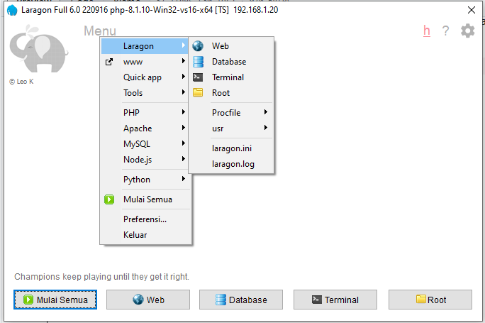
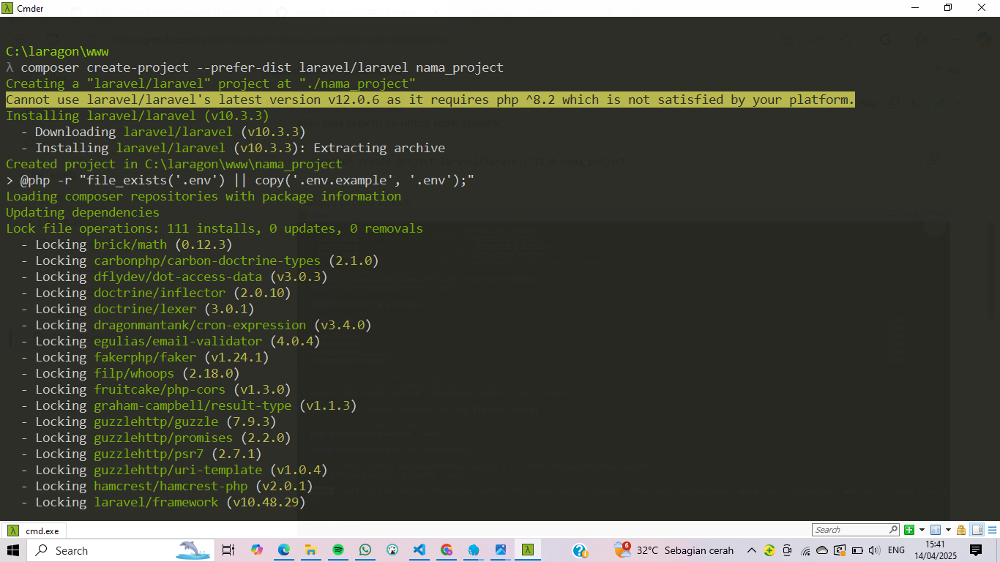
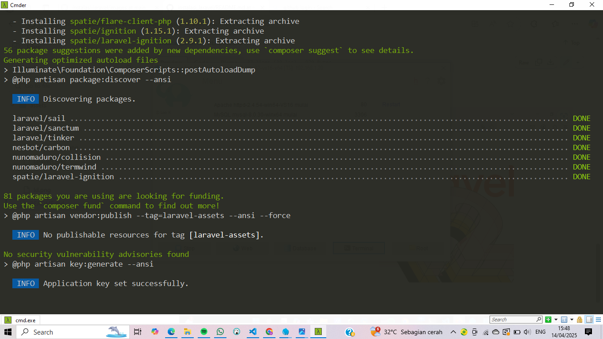
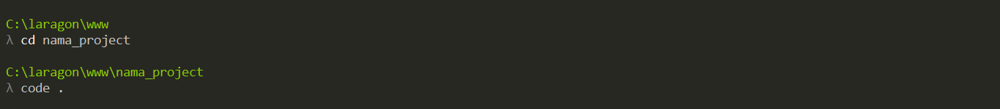
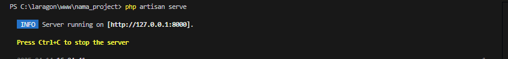
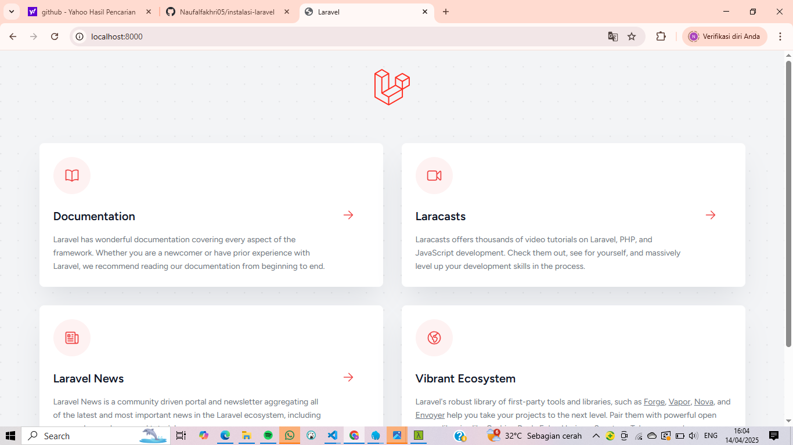

# instalasi laravel
pastikan install laragon dan composer
1. jalankan laragon,selanjutnya buka di terminal
   
2. donwload laravel(ketik seperti di bawah ini)
   composer create-project --prefer-dist laravel/laravel nama_project
   
   tunggu sampai selesai
   
3. buka laravel (cd nama_project) dan text editor (code .)
   
4. untuk menjalankan project
   php artisan serve
   
5.laravel sudah berjalan
  